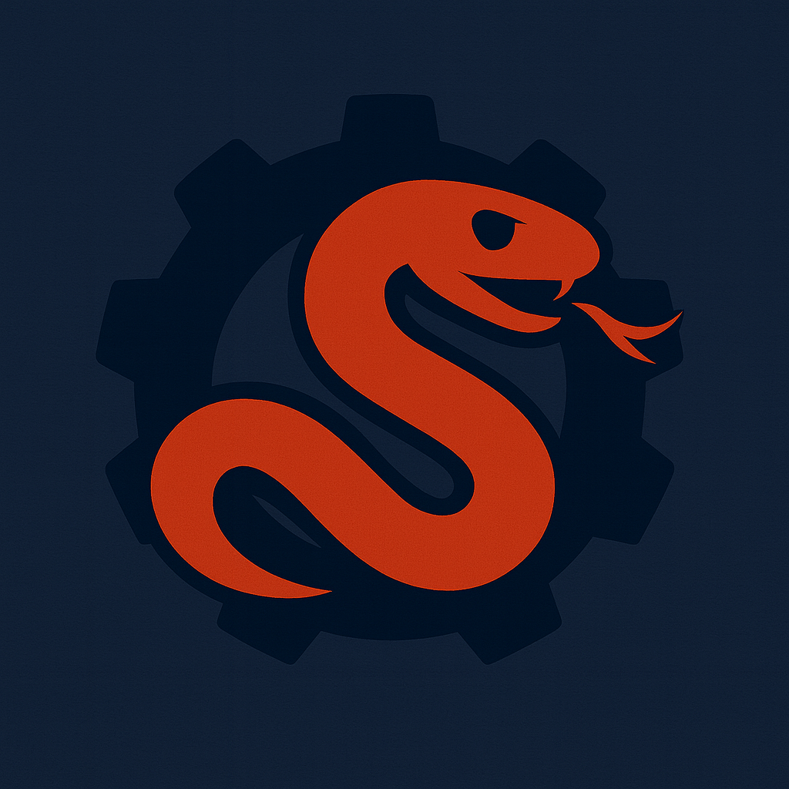

# FusionSnake

FusionSnake is a [Battlesnake](https://play.battlesnake.com/) written in Rust using the Actix Web framework. It is a simple snake that tries to avoid walls and other snakes, and tries to eat food.

Feel free to use this snake as a starting point for your own snake, or to fork it and make it your own!

## Running the Snake

### Prerequisites

- [Rust](https://www.rust-lang.org/tools/install)
- [Cargo](https://doc.rust-lang.org/cargo/getting-started/installation.html)

### Start the Snake

1. Clone the repository
2. Run the snake with `cargo run`

## What is BattleSnake?

BattleSnake is a multiplayer programming game played on a grid. Your snake is controlled by a REST API, and you program it to move around the grid and collect food. As your snake finds and eats food, it grows. The last snake slithering wins.

For more information, check out [play.battlesnake.com](https://play.battlesnake.com/).

## Credits

This project is based on the [starter-snake-rust](https://github.com/BattlesnakeOfficial/starter-snake-rust) by [@BattlesnakeOfficial](https://github.com/BattlesnakeOfficial).
